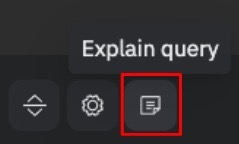

The Query Editor is where you construct your queries. You'll probably spend most of your time here.

To learn more about how to write queries, check out the [query documentation](../../query/index.md).

## Understanding the query editor

The Query editor is pretty straightforward. It's a text editor where you can write SQL code.

The editor has a few features that make your life easier:

- [Autocomplete](#autocomplete)
- [Run selection](#run-selection)
- [Explain Query](#explain-query)
- [Parameters](#parameters)

### Autocomplete

The autocomplete feature will bring up DuneSQL keywords, as well as tables and aliases you've already included in your Query.
You can always bring up the autocomplete menu by pressing `ctrl/cmd + space`.

Turn it on/off in the settings.

### Run selection

To save yourself time while testing and debugging your Queries, you can run just a part of your Query.

To do this, highlight a part of your Query. You'll then see the Run button turn into a Run selection button.

<iframe src="https://demo.arcade.software/Jb2fyuNXBUSLAcMyAOsH?embed" frameborder="0" loading="lazy" webkitallowfullscreen mozallowfullscreen allowfullscreen style="position: absolute; top: 0; left: 0; width: 100%; height: 100%;color-scheme: light;" title="Dune"></iframe>

### Parameters

Parameters allow you to implement variables in certain parts of your Query code. This is useful if you want to create a Query that you can reuse with different parameters. 

To use parameters:

1. choose the spot in your Query where you want to implement a parameter
2. click on the add parameter button or type `{{new_parameter_name}}``
3. open the parameter options 
4. configure your parameter's name, type, and default value

Parameters can be text, numbers,a date or a list of values.

If you want to use the same parameter between different queries on a dashboard, make sure to use exactly the same settings for the parameter in each query. The parameter will then be shared between the queries and only turn up once in the dashboard's parameter menu.

<iframe src="https://demo.arcade.software/wEVEG2p4ns4oXV5LSpJ3?embed" frameborder="0" loading="lazy" webkitallowfullscreen mozallowfullscreen allowfullscreen style="position: absolute; top: 0; left: 0; width: 100%; height: 100%;color-scheme: light;" title="Net flow of stake ETH last 7 days"></iframe>

### Explain Query

The explain query feature utilizes ChatGPT4 to explain your query in plain English. It's a great way to get a quick overview of what your query does.

Simply click the explain query button to see a GPT4 generated explanation of the query.

### Shortcuts

Here are a handful of shortcuts to make crafting Queries easier:

| Shortcut      | Action                         |
| ------------- | ------------------------------ |
| ctrl + enter  | execute the Query              |
| ctrl + # or / | comments out the selected code |
| ctrl + space  | brings up a list of keywords   |
| crtl + z      | undoes your last changes       |
| ctrl + y      | redoes your last changes       |
| ctrl + f      | search for keywords            |
| ctrl + h      | search and replace keywords    |

_These shortcuts work on US/UK Keyboards and might vary based on the language setting on your device._

## Query results

The Query results are displayed in a table below the Query editor.

You can sort the results by clicking on the column headers. Click once to sort ascending, click again to sort descending.
Results are paginated, so you can click through the pages to see more results. Each page shows 25 results.

You can full text search the results by using the search bar below the results table.

You can format the results according to the rules laid out in the [tables section](/visualizations/tables) of the documentation.

<iframe src="https://demo.arcade.software/FrOeNaAh5HBsESAvGUGm?embed" frameborder="0" loading="lazy" webkitallowfullscreen mozallowfullscreen allowfullscreen style="position: absolute; top: 0; left: 0; width: 100%; height: 100%;color-scheme: light;" title="Net flow of stake ETH last 7 days"></iframe>

