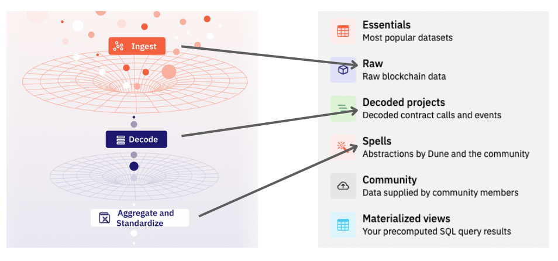

Navigating over a million data tables on Dune might seem daunting. This guide simplifies the process, highlighting the categories of datasets available and offering tips on efficient searching.

## Categories of Datasets

Dune processes blockchain data in several stages: ingestion, decoding, aggregation, and standardization. This results in three main categories: raw, decoded, and spellbook. Additionally, there's a community category that houses community-supported off-chain datasets like Reservoir, Snapshot, and others.

Beyond these, Dune showcases the most frequently used datasets under the “essential” category. Your materialized query results are neatly categorized under “materialized views”.

## Available Chains on Dune
Currently, Dune supports 10 EVM chains and 2 non-EVM chains: Solana and Bitcoin. To view the full list of [supported chains](../../data-tables/index.md), navigate to the data explorer, select “Raw”, and then click the “All chains” dropdown.

<iframe src="https://demo.arcade.software/05AwYXRMlnz4rSqlgw91?embed" frameborder="0" loading="lazy" webkitallowfullscreen mozallowfullscreen allowfullscreen style="position: absolute; top: 0; left: 0; width: 100%; height: 100%;color-scheme: light;" title="How to navigate to raw all chains"></iframe>

## Search via the Data Explorer
The data explorer is an invaluable tool for pinpointing specific datasets among the vast collection. For instance, to locate datasets for Uniswap v2 within the “Decoded” and “Spells” categories, follow the steps illustrated here:

<iframe src="https://demo.arcade.software/YSB9hBYcupzYUiHVch4z?embed" frameborder="0" loading="lazy" webkitallowfullscreen mozallowfullscreen allowfullscreen style="position: absolute; top: 0; left: 0; width: 100%; height: 100%;color-scheme: light;" title="Search data explorer examples "></iframe>

Once you've identified the desired table, use the double-arrow symbol to instantly transfer the full table name to the editor.

!!! warn
    Ensure you're at the correct search level. At times, a nested search space might yield unexpected results. We're refining this user experience. For now, the URL can help you verify your current position.

    

!!! tip --  heuristics for when to use which categories
    - Starting Point: If unsure, begin with the “Essentials” category.
    - Protocol-Specific Analysis: The “Decoded projects” category is ideal. Filter by a specific chain, event, or function to expedite your search.
    - Ecosystem Research: The “Raw” category is a good starting point. Alternatively, the “Spells” category might have pre-aggregated data for your analysis.
    - Helper Tables: Tables like [prices](../../data-tables/spellbook/top-tables/prices.md), [tokens](../../data-tables/spellbook/top-tables/tokens.md), and [labels](../../data-tables/spellbook/top-tables/labels.md) are accessible under the “Essentials” category.
