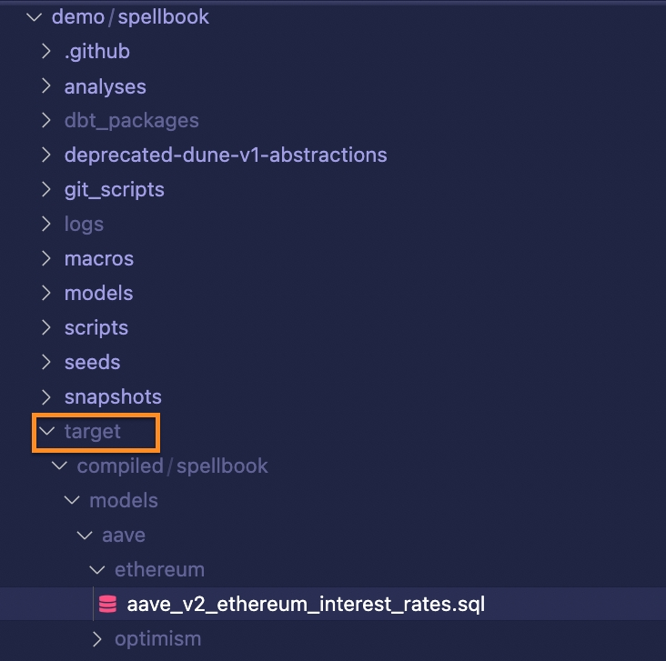

**To get started, you’ll need to install:**

1. [VSCode](https://code.visualstudio.com/) - any IDE will work but this is what we use
2. [Python 3.9](https://realpython.com/installing-python/) - you need this exact version of Python
3. [pip](https://pip.pypa.io/en/stable/installation/) - pip is a package manager for Python
4. [pipenv](https://pypi.org/project/pipenv/) - pipenv is a virtual environment manager for Python
5. [git and GitHub](https://docs.github.com/en/get-started/quickstart/set-up-git) - git is a version control system and GitHub is a hosting service for git repositories

**After that, you’ll also need to:**

* Make a [fork](https://docs.github.com/en/get-started/quickstart/fork-a-repo) of the [spellbook repo](https://github.com/duneanalytics/spellbook). Including cloning locally and adding an upstream. 
* Review Github’s [instructions](https://docs.github.com/en/pull-requests/collaborating-with-pull-requests/proposing-changes-to-your-work-with-pull-requests/creating-a-pull-request-from-a-fork) on how to make a pull request from a fork. 

For new users, we recommend using github desktop, it makes the process a bit easier.

Download Github Desktop [here](https://desktop.github.com/)

The following video focusses on the command line, but the process is the same in Github Desktop.

Essentially you:

1. Go to the Spellbook repository and click the fork button at the top.
2. Copy the HTTPS URL of your fork
3. Open the folder that you’d like to store Spellbook in inside of VS Code
4. Open a terminal in VS code and enter `git clone [paste your URL here]`

Once you hit enter, you’ll start downloading Spellbook, it’ll take a few minutes.

## Setting up Spellbook dbt

**Once you have a local copy of your Spellbook fork, it’s time to set up Spellbook dbt!**

1. Open your local copy of your Spellbook fork in VSCode, then open a terminal and enter `pipenv install`.   
You need to be in the Spellbook folder for this to work.  
This will install the packages necessary to run Spellbook on your computer.
2. run `pipenv shell` to activate your virtual environment.

3. run `dbt deps` to install the dbt dependencies.

4. run `dbt compile` to compile the dbt project. 

If that runs correctly your terminal should end with “done” and you should see the “target” folder in your sidebar

The `dbt compile` command transforms JINJA and SQL templated code into plain SQL, which you can use to test Spells on the Dune Website. The 'target' folder in your spellbook directory now contains these plain SQL versions of all models for Dune.   
If you've made changes to the repository before doing this, you can now verify the compile process is functioning right, as it won't complete if there are significant errors.  
If no changes were made previously, you can begin to add, edit, or delete files in the repository. Once you're done, run dbt compile again to test your plain SQL queries on dune.com.

**You are now ready to start working on Spellbook!**

## Coming back
If you have done this installation on your machine once, to get back into dbt, simply navigate to the spellbook repo, run pipenv shell, and you can run dbt compile again.

## What did I just do?

You now have the ability to compile your dbt model statements and test statements into plain SQL. This allows you to test those queries on the usual dune.com environment and should therefore lead to a better experience while developing spells. Running the queries will immediately give you feedback on typos, logical errors, or mismatches. This in turn will help us deploy these spells faster and avoid any potential mistakes.

